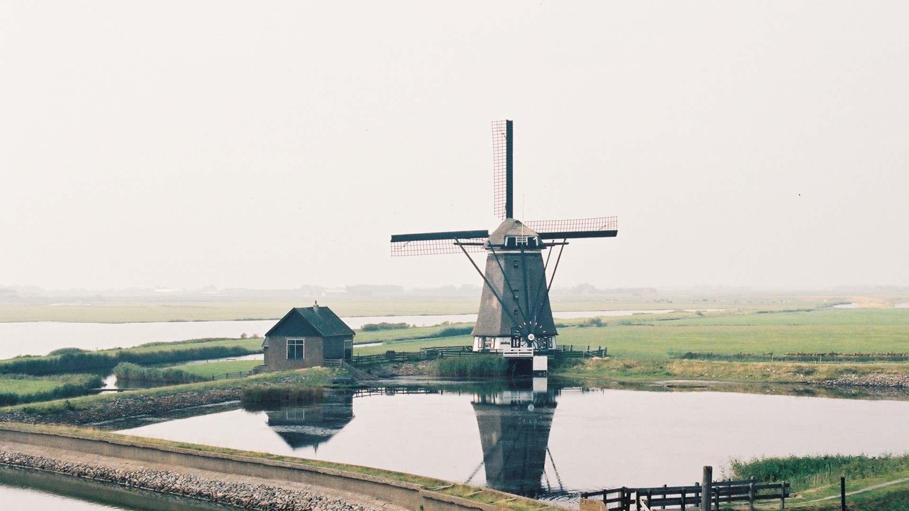

# 这是一款旋转木马轮播图，利用JQ制作的插件，学习作品，仅供学习交流！

## API文档

### HTML结构

```html
<div id="carousel" data-carousel>
    <div class="carousel-list">
        <div class="item"><a href="#"></a></div>
        <div class="item"><a href="#"></a></div>
        <div class="item"><a href="#"></a></div>
        <div class="item"><a href="#"></a></div>
        <div class="item"><a href="#"></a></div>
    </div>
    <div class="carousel-arrow">
        <div class="arrow arrow-prev"><a href="javascript:;" class="arrow-btn prev-btn"><</a></div>
        <div class="arrow arrow-next"><a href="javascript:;" class="arrow-btn next-btn">></a></div>
    </div>
</div>
```

- 每个轮播图最外层都需要设置 data-carousel属性标识，需要设置这个外层容器的样式
- 需要引入carousel.css样式文件
- 需要引入carousel.js脚本文件 
- 并且依赖jQuery文件

## 调用插件接口
```javascript
window.onload = function () {
    $('#carousel').Carousel({
        width: 1200,
        height: 400,
        imgWidth: 800,
        imgHeight: 400,
        scale: .6,
        speed: 300,
        verticalAlign: "top",
        autoPlayDelay: 4000,
        autoPlay: true
    });
};
```

## Options 参数

Options List：

- width：渲染容器的宽度
- height：渲染容器的高度
- imgWidth：图片区域的宽度
- imgHeight：图片区域的高度
- scale: 0.8：每张图与下一张图的缩放比例(0-1)的浮点值,1表示不变
- speed: 500：切换速度(ms)
- verticalAlign：居中方式[top,middle,bottom]
- autoPlay: false：是否自动播放[true,false]
- autoPlayDelay：自动播放延迟(ms)
